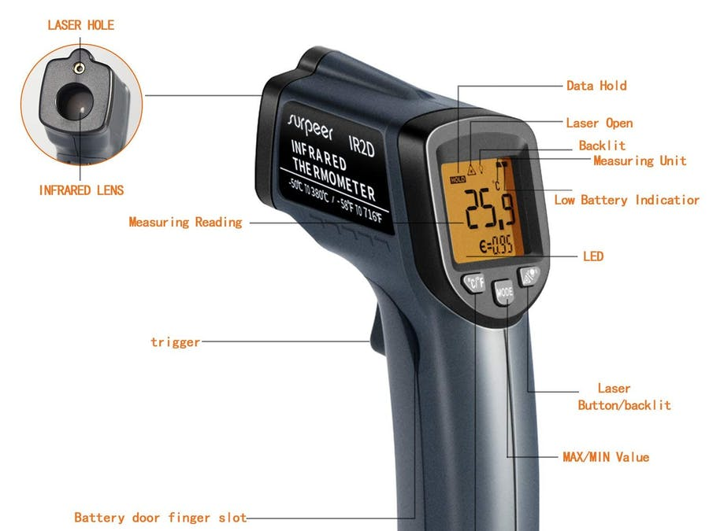
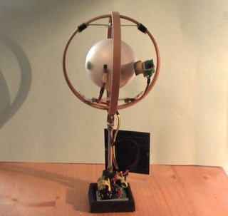
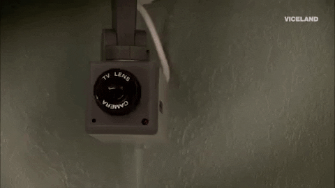
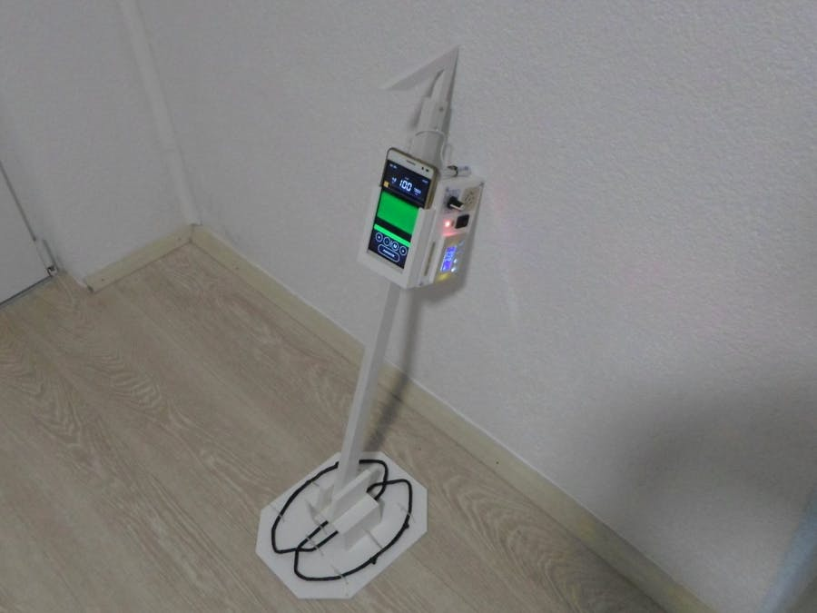
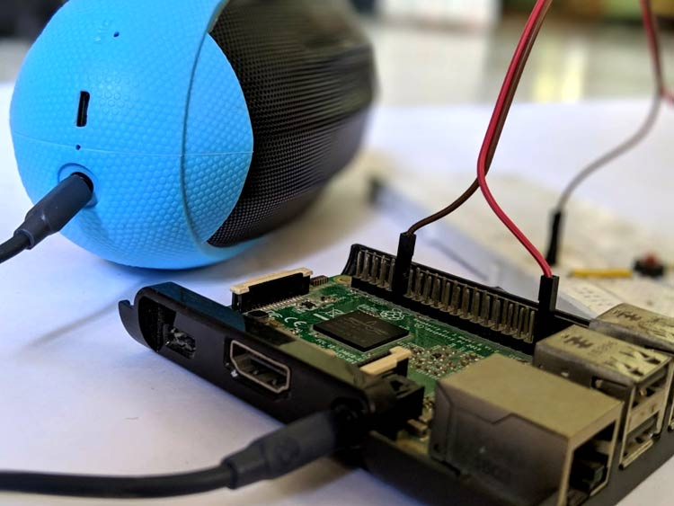
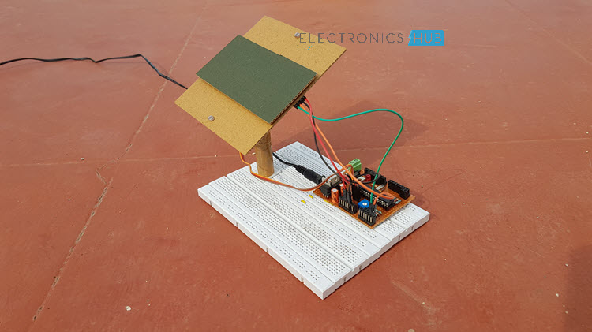
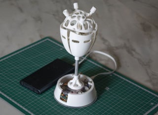

# Task-1
# Mini Task-1 
# Project 1 - Advanced Irrigation System :    
Purpose - Automated Irrigation system to overcome over or under irrigation.   
Topic -  IoT   
This project deals with the building of an IoT based smart irrigation system by analyzing the soil parameters and weather conditions. Sensors are used to detect various parameters like pressure, humidity, temperature,pH,etc. This data from the Arduino is gathered using an IoT module. The system is trained based on this data and then is tested for accuracy. So, this system uses machine learning to compare real values obtained from sensors with a test value that has been fed to the machine for analysis. The results decide whether irrigation should be done or not. This system has many other cool features like Alert Control (reporting the changes to the user through email or a text message) and Anomaly detection (identifying unexpected events by defining some threshold values).   
Project link : https://www.hackster.io/narangrahulrahul8/advanced-irrigation-system-eeb622   

# Project 2 - DIY GY-906 Infrared Thermometer using Arduino:
Purpose - No contact Temperature sensing      
Topic - Arduino     
This project is to build a No-Contact Infrared Thermometer using an Arduino Nano and a GY-906 Temperature Sensor to measure the surface temperature of an object and display on an OLED display. All the components are assembled as per the circuit diagram. The MLX90614 sensor collects the data and the installed program continuously reads this data and displays the temperature on the OLED screen when the switch is touched. The casing for the thermometer components is obtained by 3D-Printing. These thermometers are now in great use, in the first line of detection of corona virus.   
Project link : https://www.hackster.io/hardyedela/diy-arduino-gy-906-infrared-thermometer-5881aa     
   

# Project 3 - DIY Hand Soap/Sanitizer Dispenser :
Purpose - Touch free Soap/Sanitizer dispendsing      
Topic - Arduino    
This project is to build a Touch free Soap/Sanitizer dispenser using Arduino, an ultrasonic sensor and a servo motor. An IR Sensor could also be used but an ultrasonic sensor, though a bit expensive is more accurate. The servo motor and a copper wire are used to generate a downward force to push the sanitizer. The code is uploaded defining all the basic setups and then it is ready to use. All the components are packed properly. The sanitizer is pushed when a target is 10cm or closer to the sensor.    
Project link : https://www.hackster.io/MissionCritical/diy-hand-sanitizer-dispenser-using-arduino-143de1   

# Project 4 - COVID 19 Real Time Data Monitoring using NodeMCU :   
Purpose - To get the statistics of Covid-19    
Topic - NodeMCU    
This project is fairly simple to build. NodeMCU is an open source IoT platform built around ESP8266(wifi SoC). All the required libraries for fetching the data, for the LCD Display and for connecting to the server are included in the code. The module is connected to the Internet and the required URL is called through HTTP get request to fetch real-time data. The pins are configured in the code so as to display this data on the LCD display. All the suitable connections are made between the display and NodeMCU as per the circuit diagram.     
Project link : https://www.hackster.io/AmardeepV/covid-19-real-time-data-monitoring-using-nodemcu-c17e77   

# Project 5 - Interfacing GPS with 8051 Microcontroller :   
Purpose - To determine the location of a vehicle/person   
Topic - Microcontrollers     
GPS Module uses global positioning system which uses 24-32 satellites to provide location data.  It calculates the position by reading signals that are transmitted by these satellites. The raw data received is converted to suitable form for the user. The 8051 Microcontroller, LCD Display and the GPS module are connected as per the circuit diagram. The GPS receiver continuously transmits data as per NMEA standards using RS232 protocol. In NMEA format, the Latitude and longitude values are available in GPRMC sentence. The controller serially receives the data from the GPS module using UART protocol and these values are extracted from NMEA format and are displayed on the LCD.   
Project link : https://www.electronicshub.org/interfacing-gps-8051-microcontroller/    

# Project 6 - Inhouse IoT Air Quality Sensor :   
Purpose - A device to monitor inhouse air conditions   
Topic - IoT   
This project uses NodeMCU ESP8266 and the sensors Pimoroni BME680 (to detect Humidity, Temperature, Pressure,etc.) and PMS5003 (to detect Air particle density). This device connects to your home network. Then the Arduino environment for the NodeMCU is built, all the required libraries are installed and the sensors are also included in the code with suitable configurations. All the firmware is compiled and uploaded. The Web UI (User Interface) is uploaded and the sensors are added and configured. The system is rebooted and can now be used for sensing the air quality in a room.     
Project link : https://www.hackster.io/mathertel/build-an-inhouse-iot-air-quality-sensor-no-cloud-required-0971a6    

# Project 7 - WiFi Hacking using ESP8266 :
Purpose - To make a WiFi jammer using ESP8266 (a Built-in WiFi SoC module)     
Topic - Electronics    
The 802.11 (WiFi is a term for certain types of WLAN that use 802.11 specifications) contains an alleged deauthentication outline. This is used to detach customers securely from a system. We require the MAC Address of the WiFi switch and of the customer gadget which we need to detach from the system. For this, it is sufficient to be in the WiFi range. All the required installations are done initially to setup ESP8266 Deauther (Deauther allows us to disconnect a device from a network feeding on the weakness of the 802.11 protocol). Now the ESP8266 is powered up. We scan for networks and then for client devices and now we are ready to go.    
Project link : https://www.hackster.io/mrtejaslol/wifi-hacking-using-esp8266-5edb1e      
   

# Project 8 - Continuously Rotating Solar Motor :
Purpose - A continuously rotating solar powered sphere   
Topic - Electronics   
This project uses A solar panel, a super capacitor, Hall sensor, Comparator, IC:XC 6206 LDO (driver IC) and Neodymium magnets. The solar panel charges the super capacitor via a low-dropout regulator. The Hall sensor detects the rotor magnet. The pulse passes through the pulse shaper, comparator and the driver IC and activates the pulse coil. Magnetic bearings are used to reduce the friction of the rotor shaft. Rotor is made from a styrofoam globe and has magnets placed around the middle. This is an efficient pulse motor driven by small and stable nanopower circuit.    
Project link : https://www.instructables.com/id/Continuously-Rotating-Solar-Motor/     
    

# Project 9 - Use a Stepper Motor as a Rotary Encoder :
Purpose - Using a stepper motor as a rotary encoder to control the brightness of an LED   
Topic - Electronics   
A rotary encoder is a device that converts the angular position of a shaft to an analog or digital output used in automated machinery, position control, etc. This project uses a stepper motor (which generates electric pulses when rotated), but since it cannot generate enough voltage when rotated slowly, an amplifying circuit is required.    
So the stepper motor is suitably connected to the Arduino through the amplifier and the code is uploaded. This circuit can now be used to control the brightness of LED connected to pin 'D13'by adjusting the duty cycle on the output pin with the rotary encoder.    
Project link : https://www.instructables.com/id/Use-a-Stepper-Motor-As-a-Rotary-Encoder/    

# Project 10 - Raspberry Pi Security Camera :   
Purpose - To make a security camera    
Topic - IoT    
This project uses Raspberry Pi 3, Pi Camera and a PIR motion sensor. The camera is connected to the camera module port of the Pi and the PIR Motion Sensor is connected to the Pi's GPIO pins accordingly. An SD card is also inserted. Pi is turned in and the internet connectivity is checked. Then the camera is enabled in the interfacing options. Picamera module is also installed. All the required modules are created and the codes too. Then the server can be started and through the IP address, the webpage can be accessed and the camera can be controlled remotely.    
Project link : https://www.instructables.com/id/Raspberry-Pi-Security-Camera-1/      
    

# Project 11 - Reading text files from an SD card using Arduino :
Purpose - To read and display the text from a text file stored in an SD Card    
Topic - Arduino    
This project uses an SD card breakout board. SD card breakout boards are used as an external storage devices due to the limited capacity of microcontrollers. We can insert an SD card into the breakout board and thi=e data from this can be fed to any microcontroller device. We first create a tet file in an SD card and insert it in the breakout board. The connections are then made between the SD card breakout board and the Arduino and from the Arduino to the LCD display suitably. The Arduino reads the text file in the SD card and then displays it on the LCD.    
Project link : https://www.hackster.io/millerman4487/reading-text-files-from-an-sd-card-arduino-9819a0    

# Project 12 - VLF Metal Detector :
Purpose - To make a detector that can detect metal objects upto 25cm or closer   
Topic - Electronics    
This project uses two D-shaped coils, A Signal generator module, a Mofset transistor and required capacitors and resistors. The detector contains two coils - one transmitter and one receiver. The resonant frequency of the transmitter coil is calculated and it is set in the signal generator with 50% duty cycle. The potentiometer is used to control the current through the transmitter coil. The receiver coil connects to the microphone and the smartphone according to the circuit diagram. The phones output is amplified and we hear a beep when the metal is detected by interfering with the magnetic field through the coil.      
Project link : https://www.hackster.io/mircemk/diy-sensitive-vlf-metal-detector-with-smartphone-6da01f     
   

# Project 13 - Gesture Controlled Wheelchair :
Purpose - To control wheelchair movements thorugh pre-defined hand gestures   
Topic - Arduino   
This project deals with developing a prototype for a robotic wheelchair that can be controlled using simple hand gestures. It uses Arduino Uno and Nano and a Gyroscope (measures the angular position of the hand). A communication is first set-up between the Uno (Wheelchair module) and the Nano (the hand with the gyroscope). The Nano here behaves as the master and the Uno as the slave. The gestures (basically the angles) and the required movements are fed through the code to the Uno. So this gyroscope information is fed to the Uno through the Nano and the Uno performs the required action as per the code through the driver motors connected to it and gives out the required movement. We can add gestures for all the required mechanical movements.    
Project link : https://www.hackster.io/patelmonil00/gesture-controlled-wheelchair-84a206     
   

# Project 14 - Raspberry Pi based Weather Station:
Purpose - To get the weather information   
Based on - Raspberry Pi   
This project is to build a compact weather station using a wireless Raspberry Pi Zero. They used AZ-Touch Pi0 kit for the display. It is made compatible with Pizero. Then the Raspbian image is copied into an SD card and is put into the Pizero. This Raspbian image is burned and a SSH connection is enabled and the details are entered. The Raspberry Pi is then rebooted. The weather station will be launched after rebooting.     
Project link : https://www.hackster.io/hartmut-wendt/raspberry-pi-based-weather-station-a9a7dd     

# Project 15 - Locker Monitor using Bolt :
Purpose - To keep track of the lockers    
Topic - IoT      
This project is to build a module to monitor lockers using Bolt IoT device and an LDR. The resistance of LDR depends on the light intensity falling on it. When the locker is closed, it will be at a particular value. But, when it is opened, this value changes and hence this is used as a trigger to send an alert that the locker is open. The LDR are the Bolt module are suitably wired. The bolt device and the bolt cloud are connected. In the bolt cloud, the pins are configured and the code is imported as required. This configuration is deployed for setting-up a connecction between the device and the cloud. A third-party messaging app is used to send a text alert by collecting data from the bolt cloud.     
Project link : https://www.hackster.io/vbalakrishnn2501/locker-monitor-using-bolt-d370c0    

# Project 16 - Automated Parking Lot using Arduino :
Purpose - To build a parking lot model for a hassle free parking experience   
Topic - Arduino    
This project requires an Arduino, a Piezo sensor, an ultrasonic sensor, a Bluetooth module and servo motors (for the mechanical outputs). There will be a change in pressure when the car travels on the piezo sensor. The sensor sends this information to the Arduino  which in turn drives the servo motors to open the parking gates. The code consisting the required actions is uploaded to the Arduino.
Ultrasonic sensors are placed at all the parking spots to identify whether it is occupied/free. This information of where the free spots are located is made available to the user through the Bluetooth module.     

# Project 17 - Raspberry Pi Bluetooth Speaker Audio Streaming System :
 Purpose - To make a wireless Bluetooth speaker that can take audio from your phone's mic and play it on a speaker/ can also stream live            music from phone's music gallery or YouTube.     
 Topic - Raspberry Pi   
 This project requires a Raspberry Pi with built-in WiFi and Bluetooth. The RPi takes the audio via bluetooth from the phone and then transfers it to its own analogue pin (TRRS pin). But this output signal will be weak and inaudible and hence need to be amplified. This is done using a PAM amplifier module and the audio comes out of the speakers. For setting up, the RPi and the audio device (phone) are paired over bluetooth and the audio device should also be selected as the input audio. To use the phone as a mic, a suitable app is installed on it and it can be streamed over RPi.    
 Project link : https://www.electronicsforu.com/efy-guest-authors/raspberry-pi-bluetooth-speaker-audio-streaming     
     
 
# Project 18 - Sun Tracking Solar Panel :
Purpose - A Solar Panel circuit to track the Sun and position the Solar Panels accordingly    
Topic - Microcontrollers    
This project consists of two LDR's, a solar panel, a servo motor and an ATmega328 Microcontroller. The components are connected according to the circuit diagram. LDR's resistance is inversely proportional to the light intensity falling on it. Two LDR's are placed at the two ends of the solar panel. So, the panel moves towards the side where the LDR has low resistance i.e. high intensity with the help of servo motor. The code defining this is uploaded to the ATmega238 using Arduino IDE.    
Project link : https://www.electronicshub.org/sun-tracking-solar-panel/      
    

# Project 19 - Password Based Door Lock System :
Purpose - A secure door unlocking system using a password    
Topic - Microcontrollers    
This project uses 8051 Microcontroller. A 4x4 Matrix Keypad is used to enter the password which is compared with the predefined password and the door unlocks when the passwords match. An LCD is used to display if the Password entered is wrong and a motor is used for opening the door. The Microcontroller, keypad, Motor driver, the LCD and DC motor are connected according to the circuit diagram. The code is compiled and uploaded. When the circuit is switched ON, it sends a command to display "enter password" on the LCD screen. Then the password is entered. When the passwords match, the microcontroller activates the motor driver, which in turn rotates the motor and opens the door.    
Project link : https://www.electronicshub.org/password-based-door-lock-system-using-8051-microcontroller/     

# Project 20 - Heart Visualizer :    
Purpose - To design a model to visually see your heartbeat    
Topic - Arduino    
This project uses an Arduino Nano for driving the actuator and a MAX30100 Pulse Oximeter SpO2 and Heart-rate sensor module to sense the required  . The physical parts required to build a model of the heart are all 3D printed and suitably assembled. The sensor, The Arduino and the servo are connected as per the circuit diagram and the circuit is powered through a 5V battery. The necessary libraries required for the sensor are installed and the code with all the pin configurations is compiled and uploaded. The complete assembly is done and the visualiszer is powered using a power bank (5V). Now, when we place our finger on the sensor, we can see the heartbeat visually.    
Project link : https://www.instructables.com/id/Heart-Visualizer-See-You-Heart-Beat/     
    

# Project 21 -  Voltmeter using 8051 Microcontroller : 
Purpose - To make a simple 0-5V Voltmeter    
Topic - Microcontrollers    
This project uses an 8051 Microcontroller to read an input voltage and display it on a seven segment display. ADC0804 is the ADC (Analog to Digital Converter) which is interfaced to 8051. All the components are wired as per the circuit diagram. The program controls the ADC to produce a digital output corresponding to the input voltage. This is scanned by 8051 and now, suitable manipulations are done to obtain the value. This value is then displayed on the 7-segment display, which gives us the voltage value.    
Project link : http://www.circuitstoday.com/voltmeter-using-8051    

# Project 22 - Alzheimer's Assistant : 
Purpose - To make a wearable device which helps monitor the patients condition    
Topic - Arduino    
This project uses Infineon's Sensor Hub Nano (which is basically a hub of sensors for accurate pressure sensing) which sends data via bluetooth (and can also be viewed on an Android device having the Infineon app). A HC-05 bluetooth module is used to set-up a connection between the Sensor hub and the Arduino. Suitable connections are made. Once we get the data in the Arduino, it can be sent to an IoT platform (and we can personalize it according to our requirements, which is described in detail in the link below). The HC-05 module is configured and set-up. The code (with the network details) is compiled and uploaded to the Arduino. After this, the circuit is wired up as per the circuit diagram. It can be then powered up and used.    
Project link : https://www.instructables.com/id/Alzheimers-Assistant/    

# Project 23 - Line Follower Robot :   
Purpose - To make a robot that follows a specific path indicated by a black line on a light surface     
Topic - Microcontrollers   
This project uses an 8051 Microcontroller, 2 IR sensors, motor driver and motors. The base of the bot is basically a board balanced on two wheels that can be run by motors. Two IR sensors are placed in the front of the bot facing down. When the two sensors are on the line, the robot moves forward. When there is a right turn, the left sensor is activated and the bot takes a right turn and vice versa. Since the path is coloured black, the IR sensor receives back only when the sensor is out of line because, black completely absorbs IR. This property is used to move the vehicles. The code with all configurations is compiled and uploaded to the microcontroller. The sensor data is fed to the microcontroller and the controller in turn commands the motor driver to take required action and the bot moves along the line.    
Project link : https://www.electronicshub.org/line-follower-robot-using-microcontroller/   

# Project 24 -  DTMF Controlled Home Automation System :   
Purpose - Controlling home appliances using DTMF technology    
Topic - Microcontrollers    
DTMF (Dual Tone Multi Frequency) - When a button is pressed in our mobile keypad, a tone is generated. Each tone has two frequencies (row and column frequencies). These frequencies don't have a harmonic relation with each other. This property is used in this project. This output from the keypad is converted to digital form using a DTMF decoder IC HT9107B. This decoded signal is sent to an ATMEGA8 controller. The code with the pin configurations and the required functions for each tone is compiled and uploaded to the microcontroller. Using this, the microcontroller produces the required output (Turning ON/OFF a particular appliance).    
Project link : https://www.electronicshub.org/dtmf-controlled-home-automation-system-circuit/    

# Project 25 - Controlling TV using Alexa and Arduino IoT Cloud :    
Purpose - To use Alexa (voice commands) to control our TV    
Topic -  IoT and Arduino      
This project uses an Arduino Nano 33 IoT and an IR receiver and transmitter. Arduino IoT Cloud platform allows us to build an IoT connected object. We also use the Official Arduino Alexa Skill in this project. The remote data is first captured with the IR receiver and the Arduino. The remote is pointed at the Arduino IR receiver and all the buttons corresponding to the required functions are pressed and the data is collected (comes on the Serial monitor). These are included in the code. We connect our Arduino board to the IoT Cloud and we also add the code (including the IR library). The IR data already collected is used and a function to send out IR commands and blink the built-in LED is written in the code and the corresponding actions are associated. Now, we have to download Amazon Alexa App and install Arduino Alexa Skill and enable it. Now, we are ready to control our TV by voice commands.    
Project link : https://create.arduino.cc/projecthub/313276/full-control-of-your-tv-using-alexa-and-arduino-iot-cloud-9e7c4d    

 
